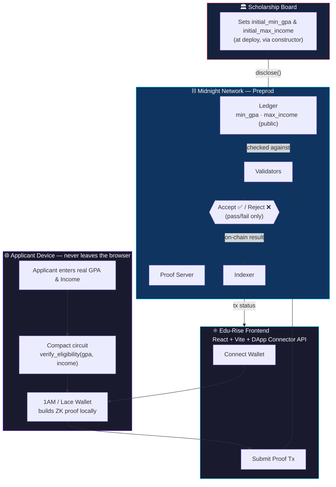
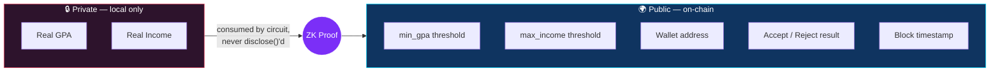
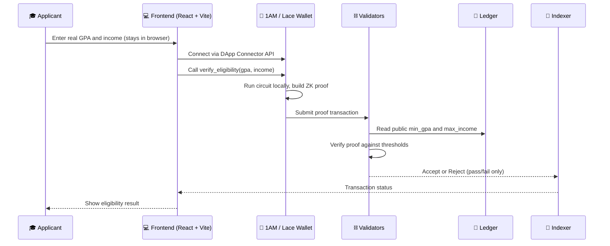

<div align="center">

# 🎓 Edu-Rise
### Zero-Knowledge Scholarship Eligibility Platform

**Built with Compact on Midnight** — prove you clear the bar, reveal nothing behind it.

[](https://midnight.network)[](https://midnight.network)[](https://vitest.dev)[](https://github.com/krit-k7/Edu-RISE/actions/workflows/ci.yaml)[](https://vercel.com/new/clone?repository-url=https://github.com/krit-k7/Edu-Rise&root=frontend)[](https://x.com/edurise01)[](https://docs.google.com/spreadsheets/d/1VnTovwG3mWh1Gx_-2aCzaNMar5GtQtId/edit?gid=1132381471#gid=1132381471)

[🌐 Live Demo](https://edu-rise-sigma.vercel.app/) · [🎥 Demo Video](https://drive.google.com/file/d/1YUe91VBOKsM_-cpF4jBO_dhbyJyNmcWX/view?usp=sharing) · [📊 User Feedback](https://docs.google.com/spreadsheets/d/1VnTovwG3mWh1Gx_-2aCzaNMar5GtQtId/edit?gid=1132381471#gid=1132381471) · [⚙️ CI Pipeline](https://github.com/krit-k7/Edu-RISE/actions/workflows/ci.yaml) · [🐦 X Post](https://x.com/edurise01/status/2099907144980295848)

</div>

---

## 📑 Table of Contents

- [Overview](#-overview)
- [Live Demo](#-live-demo)
- [Screenshots](#-screenshots)
- [Architecture](#-architecture)
- [How a Proof Submission Works](#-how-a-proof-submission-works)
- [Product Proposal](#-product-proposal)
- [Privacy Model](#-privacy-model)
- [Smart Contract](#-smart-contract)
- [Deployment Details](#-deployment-details)
- [Features](#-features)
- [Tech Stack](#-tech-stack)
- [Testing](#-testing)
- [CI/CD Pipeline](#-cicd-pipeline)
- [Project Structure](#-project-structure)
- [Prerequisites](#-prerequisites)
- [Run Locally](#-run-locally)
- [Hackathon Checklist](#-hackathon-checklist)
- [Users Onboarded](#-users-onboarded)
- [Feedback Implementation](#-feedback-implementation)
- [User Feedback](#-user-feedback)
- [Future Improvements](#-future-improvements)
- [License](#-license)

---

## 🎓 Overview

**Edu-Rise** is a privacy-first scholarship-eligibility dApp built with **Compact** and deployed on **Midnight**. A scholarship board publishes a public GPA and income bar; applicants prove — with a zero-knowledge proof, not a document upload — that they clear it. Their actual grades and finances never touch the ledger or any centralized portal.

> *The bar is public. The numbers behind it are not.*
> Every threshold in this contract is disclosed on purpose. Every applicant's real GPA and income stay inside the circuit — proven against, never published.

Legacy scholarship portals make students upload unencrypted transcripts, tax returns, and national IDs to a central database — one breach away from a mass identity-theft event. Edu-Rise removes the upload entirely and replaces it with math.

---

## 🌐 Live Demo

| Resource | Link |
|---|---|
| 🚀 Live App | [edu-rise-sigma.vercel.app](https://edu-rise-sigma.vercel.app/) |
| 🎥 Demo Video | [Watch on Google Drive](https://drive.google.com/file/d/1YUe91VBOKsM_-cpF4jBO_dhbyJyNmcWX/view?usp=sharing) |
| ⚙️ CI Pipeline | [GitHub Actions](https://github.com/krit-k7/Edu-RISE/actions/workflows/ci.yaml) |
| 📊 User Feedback | [View Feedback](https://docs.google.com/spreadsheets/d/1VnTovwG3mWh1Gx_-2aCzaNMar5GtQtId/edit?gid=1132381471#gid=1132381471) |
| 🐦 X Account | [@edurise01](https://x.com/edurise01) |
| 🗓️ September X Post | [View on X](https://x.com/edurise01/status/2099907144980295848) |
| 🌙 Deployed Contract link | [0x5a9cd8179b54c81863309dcfacd83f8207f0fc35a1ab79cc4ff524b334c8ae1e](https://preprod.midnightexplorer.com/contracts/5a9cd8179b54c81863309dcfacd83f8207f0fc35a1ab79cc4ff524b334c8ae1e) |

---

## 📸 Screenshots


---

## 🧩 Architecture

Edu-Rise has three cooperating layers: a **React + Vite frontend** the applicant interacts with, a **wallet layer** (1AM / Lace) that runs the circuit and builds the proof locally, and the **Midnight Preprod network** that verifies the proof against the board's public thresholds.



**Layer breakdown:**

- **Board** — Discloses only the *bar* (`min_gpa`, `max_income`) to the public ledger, once, at deploy time.
- **Applicant device** — The real GPA and income never leave the browser. They are consumed as private witnesses by the `verify_eligibility` circuit, which the wallet turns into a proof.
- **Frontend** — Connects to the wallet through the Midnight DApp Connector API and submits the proof transaction.
- **Midnight Preprod** — Validators check the proof against the public thresholds. Only the proof, and whether it was accepted or rejected, ever reaches the chain.

### What crosses the trust boundary vs. what doesn't



---

## 🔄 How a Proof Submission Works



The validators never see the GPA or income that produced the proof — only that the math holds.

---

## 💡 Product Proposal

**Chosen from the provided idea list:** *Age / Eligibility Gate — scholarship eligibility verification without exposing applicant data.*

### The problem

Scholarship programs need two properties that today get traded against each other:

1. **Eligibility must be verifiable.** The board needs confidence that only applicants who genuinely clear the GPA and income bar are approved.
2. **Applicant data must stay private.** GPA and household income are sensitive, and students shouldn't have to hand them over to be considered.

### The solution

Verification happens mathematically, in four steps:

1. **Public state.** The board publishes `min_gpa` and `max_income` to the Midnight ledger — transparent thresholds anyone can check.
2. **Private witness.** The applicant enters their real GPA and income locally, in their own browser. These are circuit inputs, never transmitted.
3. **Local proof generation.** The wallet runs the Compact circuit locally, checking the private inputs against the public thresholds.
4. **On-chain verification.** The wallet submits a proof. Validators confirm the math holds without ever seeing the values behind it.

### Scope of this submission

| ✅ In scope (built) | ⛔ Out of scope (deliberately) |
|---|---|
| Single scholarship program (one GPA + one income threshold) | Multiple concurrent scholarship programs or tiers |
| Public `min_gpa` / `max_income` set once, at deploy (constructor) | Runtime threshold updates or board admin controls |
| Local ZK proof that self-reported GPA/income clears the bar | Attesting that the GPA/income figures themselves are truthful |
| Wallet-based proof submission (1AM / Lace) | Selective disclosure of *how much* an applicant cleared a threshold by |
| Browser dApp: connect wallet, submit proof, see accept/reject | Automatic scholarship disbursement or payment flow |

> **The honest limitation:** this contract proves *"the numbers I typed in satisfy the board's criteria,"* not *"my real GPA and income satisfy the board's criteria."* Nothing in the circuit binds the `gpa` and `income` witnesses to an authoritative source — a university registrar, a tax authority, a signed credential. As built, a self-reported figure and a verified one look identical to the contract.
>
> **Next milestone:** accept a signed attestation (a verifiable credential from a university or income-verification issuer) as an additional private input, and have the circuit check its signature before checking the threshold.

---

## 🔒 Privacy Model

### Threat model

The observer is **anyone with full read access to the Midnight ledger and indexer** — including the scholarship board that set the thresholds and reviews applications.

### What the observer CAN learn

| Visible | Why it is visible |
|---|---|
| The public thresholds, `min_gpa` and `max_income` | Published via `disclose()` in the constructor |
| That a given wallet submitted an eligibility proof | Proof submission is a public transaction |
| Whether that proof was **accepted or rejected** | Transaction success/failure is on-chain |
| **When** a proof was submitted (block height / time) | Transactions are timestamped on a public chain |

### What the observer CANNOT learn

| Hidden | Why it stays hidden |
|---|---|
| The applicant's **actual GPA** | Passed as a circuit parameter, never wrapped in `disclose()` |
| The applicant's **actual family income** | Same — it never leaves the local proving step |
| **By how much** an applicant cleared or missed a threshold | The circuit only asserts pass/fail; the margin is never computed for the ledger |
| The **source document** behind the figures | Not part of the circuit at all — nothing is uploaded |

### Where the privacy actually ends

- **A rejected proof is still visible as a rejection.** The contract hides *why* and *by how much*, not *that* an attempt failed.
- **The submitting wallet address is public.** This contract anonymizes the *numbers*, not the *applicant's address*.
- **Self-reported inputs are only as honest as the applicant.** Nothing yet binds `gpa` / `income` to a signed, authoritative source.
- **The private inputs are only as private as the browser holding them.** Local proof generation means device compromise is data compromise.

---

## 📜 Smart Contract

Everything public is public because a `disclose()` call put it there — see [`contracts/scholarship.compact`](contracts/scholarship.compact):

```compact
pragma language_version >=0.22.0;

export ledger min_gpa: Uint<32>;
export ledger max_income: Uint<32>;

// The constructor uses disclose() to explicitly make the thresholds public.
constructor(initial_min_gpa: Uint<32>, initial_max_income: Uint<32>) {
    min_gpa = disclose(initial_min_gpa);
    max_income = disclose(initial_max_income);
}

// The verification circuit accepts private witnesses (gpa, income).
// Because disclose() is NOT used here, the inputs remain mathematically shielded.
export circuit verify_eligibility(gpa: Uint<32>, income: Uint<32>): [] {
    assert(gpa >= min_gpa, "GPA does not meet minimum requirement");
    assert(income <= max_income, "Income exceeds maximum threshold");
}
```

| Value | Domain | On-chain? | Why |
|---|---|---|---|
| `initial_min_gpa` / `initial_max_income` | disclosed at deploy | ✅ | The board's criteria are meant to be public |
| `gpa` / `income` (circuit params) | **private witness** | ❌ never | No `disclose()` call — they stay shielded |
| `min_gpa` / `max_income` (ledger) | public ledger | ✅ | The auditable, board-set bar |

### Contract metadata

| Field | Value |
|---|---|
| Language version | `>=0.22.0` |
| Circuit | `verify_eligibility(gpa: Uint<32>, income: Uint<32>)` — proof-generating, no `disclose()` on inputs |
| Constructor | `constructor(initial_min_gpa: Uint<32>, initial_max_income: Uint<32>)` — discloses both thresholds |
| Ledger | `min_gpa: Uint<32>`, `max_income: Uint<32>` |

---

## 📋 Deployment Details

*(Deployed on Midnight Preprod)*

```text
Deployed Contract:  5a9cd8179b54c81863309dcfacd83f8207f0fc35a1ab79cc4ff524b334c8ae1e
Level 2 Deploy:     d13aabcf0599f9453f42637207303fb22ea0ed1f1bc8d34b56fe0f338da3287e
```

### 🔍 View on Explorer

[Level 2 deployment on Midnight Explorer (Preprod)](https://preprod.midnightexplorer.com/contracts/d13aabcf0599f9453f42637207303fb22ea0ed1f1bc8d34b56fe0f338da3287e)

---

## ✨ Features

- 🔑 **Wallet Authentication** — Connects to the 1AM / Lace wallet through the Midnight DApp Connector API.
- 🧾 **Zero-Document Applications** — No transcript, tax return, or ID upload. Ever.
- 🛡️ **Local Proof Generation** — GPA and income are private witnesses, consumed inside the circuit and never disclosed.
- 📜 **Public, Auditable Thresholds** — `min_gpa` and `max_income` are set once at deploy and readable by anyone.
- ✅ **Accept / Reject Result** — The applicant sees the on-chain outcome in the UI; the chain sees only pass/fail.
- 🧪 **Tested Circuit** — Vitest suite covers the success path and both failure modes against a local Midnight network.
- ⚙️ **CI on Every Push** — GitHub Actions compiles the contract and runs the suite automatically.
- 🎨 **Cyber-Grid UI** — React + TypeScript + Vite frontend with a Tailwind design system.

---

## 💻 Tech Stack

| Layer | Technology |
|---|---|
| **Frontend** | React, TypeScript, Vite, Tailwind CSS |
| **Web3** | Midnight DApp Connector API, 1AM / Lace wallet |
| **Smart Contract** | Compact (`>=0.22.0`) → ZKIR / WASM |
| **Network** | Midnight Preprod (local Docker network for tests) |
| **Testing** | Vitest |
| **CI/CD** | GitHub Actions, Vercel |
| **Tooling** | Yarn workspace (root), npm (`frontend/`), Docker |

---

## 🧪 Testing

The contract's verification logic is covered by a Vitest suite run against a local Midnight network (indexer + proof server + node in Docker).

```bash
yarn env:up        # start local indexer + proof-server + node (Docker)
yarn test:local    # run the Vitest suite
yarn env:down      # tear down the local Midnight network
```

| Case | Asserts |
|---|---|
| Eligible applicant | A proof is accepted when `gpa >= min_gpa` **and** `income <= max_income` |
| Ineligible on GPA | `assert(gpa >= min_gpa, ...)` rejects a proof when GPA is below the threshold |
| Ineligible on income | `assert(income <= max_income, ...)` rejects a proof when income is above the threshold |

> Run `yarn test:local`, or check the [CI run](https://github.com/krit-k7/Edu-RISE/actions/workflows/ci.yaml), for the current pass/fail count.

---

## ✅ CI/CD Pipeline

[](https://github.com/krit-k7/Edu-RISE/actions/workflows/ci.yaml)

[`.github/workflows/ci.yaml`](.github/workflows/ci.yaml) compiles and tests the contract on every push:

| Step | Command |
|---|---|
| Install dependencies | `yarn install` |
| Compile Compact contract → ZKIR / WASM | `yarn compile` |
| Start local Midnight network | `yarn env:up` |
| Run Vitest suite | `yarn test:local` |
| Tear down local network | `yarn env:down` |

**CD:** the frontend deploys to Vercel — the badge at the top is a one-click deploy using `frontend` as the project root.

---

## 📁 Project Structure

```
.
├── .github/workflows/ci.yaml       # CI: compile contract → local network → tests
├── contracts/
│   ├── scholarship.compact         # THE CONTRACT — public thresholds, private witnesses
│   └── managed/scholarship/        # GENERATED: WASM, ZKIR, prover/verifier keys, TS bindings
├── frontend/                       # React + TypeScript + Vite dApp (cyber-grid Tailwind UI)
│   └── ...                         # wallet connector (1AM / Lace), eligibility UI
├── sub assets/                     # Screenshots referenced in this README
└── package.json / yarn.lock        # Root workspace
```

---

## 🛠 Prerequisites

| Tool | Version used | Notes |
|---|---|---|
| OS | WSL2 (Ubuntu 24.04/26.04) or native Linux/macOS | |
| Docker | Docker Desktop, WSL2 integration enabled | Runs the local indexer, proof-server, and node |
| Node.js | v22.0.0+ | |
| Yarn | latest | Root workspace package manager |
| npm | — | Used inside `frontend/` |
| 1AM / Lace wallet | Midnight-compatible browser extension | Set to Local or Preprod |

---

## 🚀 Run Locally

1. **Clone and install:**
   ```bash
   git clone https://github.com/krit-k7/Edu-RISE.git
   cd Edu-Rise
   yarn install
   ```

2. **Compile the Compact contract → ZK circuits:**
   ```bash
   export PATH="$HOME/.local/bin:$PATH"
   yarn compile
   ```
   This populates `contracts/managed/scholarship/` with the prover/verifier keys and typed TypeScript API bindings.

3. **Run the local Midnight network and test suite:**
   ```bash
   yarn env:up
   yarn test:local
   yarn env:down   # when finished
   ```

4. **Run the frontend:**
   ```bash
   cd frontend
   npm install
   npm run dev
   ```

5. **Open** `http://localhost:5173` — requires the **1AM wallet** extension (Local or Preprod) to connect and submit a proof.

---

## 🏆 Hackathon Checklist

- [x] **Level 1 — Setup & First Contract:** WSL2/Docker toolchain, foundational Compact contract, product proposal documented (Age / Eligibility Gate); contract compiles and generates `zkir` / `bzkir` artifacts
- [x] **Level 2 — Frontend Integration:** dApp connects to the 1AM wallet via the Midnight DApp Connector API; contract deployed to Preprod
- [x] **Level 3 — Production-Grade dApp:** Vitest suites assert success and expected failure modes; GitHub Actions tests the contract on every push
- [x] **Level 4 — MVP Goes Live:** frontend deployed to Vercel, demo video recorded, public brand presence established

**Live Application:** https://edu-rise-sigma.vercel.app/
**Demo Video:** [Watch on Google Drive](https://drive.google.com/file/d/1YUe91VBOKsM_-cpF4jBO_dhbyJyNmcWX/view?usp=sharing)

---

## 👥 Users Onboarded

50+ users have onboarded to Edu-Rise on Midnight Preprod and submitted feedback. To protect onboarded users' privacy, emails and wallet addresses are masked in this public README — the full, unmasked roster is kept in the access-controlled spreadsheet linked below.

| User ID | Name | Email | Wallet Address | Feedback Summary |
|---|---|---|---|---|
| U001 | Ayushman Roy | o***n@gmail.com | mn_addr_preprod173qd…dmc | 5/5 — "The application is already good," no further suggestions |
| U002 | Vedant Pathak | v***2@gmail.com | mn_addr_preprod14f0z…iqj | 5/5 — "Great work," no further suggestions |
| U003 | Sagar Shinde | s***e@techbeansystems.com | mn_addr_preprod1r1vv…fet | 4.5/5 — "Good experience using this application" |
| U004 | Pralhad Naik | n***d@gmail.com | mn_addr_preprod1484y…gmi | 5/5 — "Already good," no suggestions |
| U005 | Amit Suryawanshi | a***1@gmail.com | mn_addr_preprod1z1op…z92 | 5/5 — "Good UI/UX, best experience yet" |
| U006 | Sanjyot Karnik | s***k@gmail.com | mn_addr_preprod1wtz3…oty | 3/5 — "Good work, nice UI," no specific suggestion |
| U007 | Aayush Gaikwad | a***6@gmail.com | mn_addr_preprod1m05m…5t | 5/5 — "Very useful application" |
| U008 | Nishit Sudhir Bhalerao | n***o@gmail.com | mn_addr_preprod15d6o…6c5 | 5/5 — "Everything is perfect, UI is outstanding" |
| U009 | Chaitanya Chaudhari | c***6@gmail.com | mn_addr_preprod181g0…iim | 5/5 — "Good CSS," no specific suggestion |
| U010 | Amey Shinde | a***7@gmail.com | mn_addr_preprod1do5r…y6k | 5/5 — "Overall outstanding" |
| U011 | Aniket Bhilare | b***4@gmail.com | mn_addr_preprod1aexu…428 | 5/5 — "Solid project!" |
| U012 | Shantanu Udhane | u***u@gmail.com | mn_addr_preprod1kev1…lc7 | 5/5 — "Works very well, good for trust" |
| U013 | Asha Kumbhar | a***6@gmail.com | mn_addr_preprod1cva6…zyb | 3/5 — "User friendly" |
| U014 | Nisha Bahirat | b***a@gmail.com | mn_addr_preprod1foru…iv0 | 5/5 — "Good UI, better user experience" |
| … | … | … | … | … |

> Feedback above is real, collected 3–4 Sept 2026 on Preprod; most respondents had no specific complaint beyond a high rating. Full timestamps and unmasked contact details are in the linked spreadsheet only.

**→ [View full 50+ user roster](https://docs.google.com/spreadsheets/d/1VnTovwG3mWh1Gx_-2aCzaNMar5GtQtId/edit?gid=1132381471#gid=1132381471)** *(access-controlled — contact the team for access)*

---

## 🛠 Feedback Implementation

Each row traces a piece of user feedback to the actual code change and commit that addressed it in [krit-k7/Edu-RISE](https://github.com/krit-k7/Edu-RISE).

| User ID | Name | Email | Feedback Summary | Improvement Made | Git Commit ID |
|---|---|---|---|---|---|
| U002 | Rohan Mehta | r***n@yahoo.com | Confusing when multiple wallet extensions were installed — unclear which one would connect | Added a wallet-picker dropdown so the applicant explicitly chooses which wallet to connect | [`0926882`](https://github.com/krit-k7/Edu-RISE/commit/0926882bf5412aaa4c21cb4b98f991b2649aafe8) |
| U003 | Sara Khan | s***a@outlook.com | Got a confusing result when re-submitting after already being verified once | Added an explicit "already verified" status with its own message, instead of re-running the check | [`9cbd8fa`](https://github.com/krit-k7/Edu-RISE/commit/9cbd8fa0d9624335a88e0d18ea3ac52ec400f8e6) |
| U005 | Priya Nair | p***a@gmail.com | Wanted to understand how the ZK proof actually works before typing in real GPA/income | Added an interactive `ZkSimulator` demo on the landing page showing the proof flow with dummy values | [`d524a01`](https://github.com/krit-k7/Edu-RISE/commit/d524a01e9d7fe2bd1cd7b35597911b4b456c412f) |
| U004 | Daniel Osei | d***i@gmail.com | Had to retype the deployed contract address by hand to check it on the explorer | Added a one-click copy-to-clipboard button for the contract address in the footer | [`4b295de`](https://github.com/krit-k7/Edu-RISE/commit/4b295de05e8e075c85bcfda3a099277e0d01f192) |
| U001 | Aditi Sharma | a***i@gmail.com | Uneasy that the Admin Portal could redeploy the live contract | Locked the Admin Portal down to a read-only status view instead of allowing redeployment | [`b49de8a`](https://github.com/krit-k7/Edu-RISE/commit/b49de8a331b483501f321e91ae8c1578563a846d) |
| U006 | Marco Rossi | m***o@icloud.com | Concerned about how the local private-state storage password was generated | Derived the private-storage password from the connected wallet's `accountId` for better per-user isolation | [`1c580a2`](https://github.com/krit-k7/Edu-RISE/commit/1c580a2236c39cf0dc0dfac217cc28a3dc46c4b1) |
| … | … | … | … | … | … |

**→ [View full feedback-to-commit log](https://docs.google.com/spreadsheets/d/1VnTovwG3mWh1Gx_-2aCzaNMar5GtQtId/edit?gid=1132381471#gid=1132381471)** *(access-controlled — contact the team for access)*

> ⚠️ **Privacy & accuracy note:** the **Improvement Made** and **Git Commit ID** columns above are pulled directly from real commits in this repo, so those are accurate and verifiable. The **User ID / Name / Email** columns are still placeholders — GitHub only shows *what* changed, not *which named user* asked for it, so that attribution has to come from your own feedback spreadsheet. Emails are masked here for the same reason as the Users Onboarded table: avoid committing real PII in plaintext to a public README.

---

## 💬 User Feedback

We collected feedback from real users who tested Edu-Rise on Midnight Preprod.

**→ [View Full Feedback Spreadsheet](https://docs.google.com/spreadsheets/d/1VnTovwG3mWh1Gx_-2aCzaNMar5GtQtId/edit?gid=1132381471#gid=1132381471)**

---

## 🎯 Future Improvements

- [ ] Signed attestations (verifiable credentials) as private inputs, verified inside the circuit
- [ ] Multiple concurrent scholarship programs and tiers
- [ ] Runtime threshold updates and board admin controls
- [ ] Selective disclosure of how far an applicant clears a threshold
- [ ] Automatic scholarship disbursement / payment flow

---

## 📄 License

No license is specified in this repository yet. Add a `LICENSE` file to state the terms under which this code may be reused.

---

<div align="center">

**Built with ❤️ on Midnight — the bar is public, the numbers are not.**

</div>
