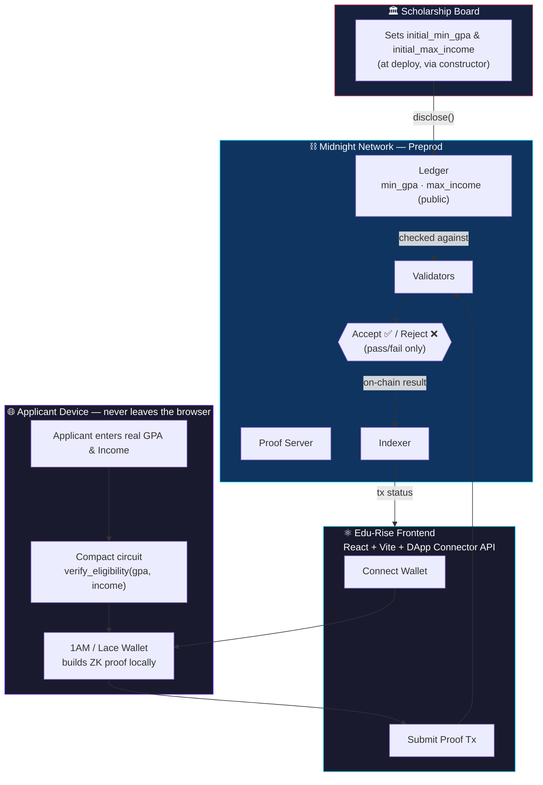
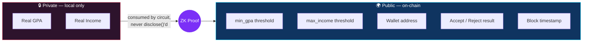

# 🎓 Edu-Rise — Prove eligibility, reveal nothing

[](https://midnight.network)
[](https://midnight.network)
[](https://vitest.dev)
[](https://github.com/krit-k7/Edu-RISE/actions/workflows/ci.yaml)
[](https://vercel.com/new/clone?repository-url=https://github.com/krit-k7/Edu-Rise&root=frontend)
[](https://x.com/zoid7r/status/2093733340386103434)

A privacy-first scholarship-eligibility dApp built with **Compact** and deployed on **Midnight**. A scholarship board publishes a public GPA and income bar; applicants prove — with a zero-knowledge proof, not a document upload — that they clear it, while their actual grades and finances never touch the ledger or any centralized portal.

> *The bar is public. The numbers behind it are not.*
> Every threshold in this contract is disclosed on purpose. Every applicant's real GPA and income stay inside the circuit — proven against, never published.

**Submission:** Hackathon Level 4 (MVP Goes Live) · **Chosen idea:** Age / Eligibility Gate — scholarship eligibility verification without exposing applicant data.

---

## 🔗 Live Demo & Contract

| | |
|---|---|
| **Live Demo** | [edu-rise-sigma.vercel.app](https://edu-rise-sigma.vercel.app/) |
| **Deployed Contract Address** | `d13aabcf0599f9453f42637207303fb22ea0ed1f1bc8d34b56fe0f338da3287e` |
| **Network** | Midnight Preprod |
| **Demo Video** | [Watch on Google Drive](https://drive.google.com/file/d/1YUe91VBOKsM_-cpF4jBO_dhbyJyNmcWX/view?usp=sharing) |
| **CI** | [GitHub Actions](https://github.com/krit-k7/Edu-RISE/actions/workflows/ci.yaml) |


---

## 🏗️ Architecture

Click the diagram to pan/zoom (GitHub renders Mermaid natively with zoom controls).



**Read it left to right:** the Board discloses only the *bar* (`min_gpa`, `max_income`) to the public ledger. The applicant's real GPA/income never leave their browser — they're consumed as private witnesses by the `verify_eligibility` circuit, which the wallet turns into a proof. Only that proof — and whether it was accepted or rejected — ever reaches the chain.

### What crosses the trust boundary vs. what doesn't



---

## 💡 Product proposal — Age / Eligibility Gate

**Chosen from the provided idea list:** *Age / Eligibility Gate — scholarship eligibility verification without exposing applicant data.*

### The problem

Scholarship programs need two properties that today get traded against each other:

1. **Eligibility must be verifiable.** The board needs confidence that only applicants who genuinely clear the GPA and income bar are approved.
2. **Applicant data must stay private.** GPA and household income are sensitive, and students shouldn't have to hand them over to be considered.

Legacy scholarship portals resolve this by making students upload unencrypted transcripts, tax returns, and national IDs to a centralized database — turning every applicant's most sensitive records into a single breach target and a standing identity-theft risk.

### The solution

Edu-Rise removes the document upload entirely. Verification happens mathematically, in four steps:

1. **Public state.** The scholarship board publishes `min_gpa` and `max_income` to the Midnight ledger — fully transparent thresholds anyone can check.
2. **Private witness.** The applicant enters their real GPA and income locally, in their own browser. These values are circuit inputs, never transmitted anywhere.
3. **Local proof generation.** The wallet runs the Compact circuit locally, checking the private inputs against the public thresholds.
4. **On-chain verification.** The wallet submits a proof. Validators confirm the math holds — without ever seeing the GPA or income that produced it.

### Scope of this submission

| ✅ In scope (built) | ⛔ Out of scope (deliberately) |
|---|---|
| Single scholarship program (one GPA + one income threshold) | Multiple concurrent scholarship programs or tiers |
| Public `min_gpa` / `max_income` set once, at deploy (constructor) | Runtime threshold updates or board admin controls |
| Local ZK proof that self-reported GPA/income clears the bar | Attesting that the GPA/income figures themselves are truthful |
| Wallet-based proof submission (1AM / Lace) | Selective disclosure of *how much* an applicant cleared a threshold by |
| Browser dApp: connect wallet, submit proof, see accept/reject | Automatic scholarship disbursement or payment flow |

**The honest limitation:** this contract proves *"the numbers I typed in satisfy the board's criteria,"* not *"my real GPA and income satisfy the board's criteria."* Nothing in the circuit binds the `gpa` and `income` witnesses to an authoritative source — a university registrar, a tax authority, a signed credential. As built, that binding doesn't exist, so a self-reported figure and a verified one look identical to the contract.

**Next milestone:** accept a signed attestation (a verifiable credential from a university or income-verification issuer) as an additional private input, and have the circuit check its signature before checking the threshold. The public/private split this repo already enforces is exactly what that upgrade builds on top of.

### Who it is for, next

The eventual product is *"apply to any scholarship without uploading a single document, and get a provably fair yes or no."* The contract in this repo is that product's trust anchor; the web app in this repo is its first usable surface.

---

## 🔒 Privacy model — what an observer can and cannot learn

### Threat model

The observer here is **anyone with full read access to the Midnight ledger and indexer** — including the scholarship board that set the thresholds and reviews applications.

### What the observer CAN learn

| Visible | Why it is visible |
|---|---|
| The public thresholds, `min_gpa` and `max_income` | Published via `disclose()` in the constructor |
| That a given wallet submitted an eligibility proof | Proof submission is a public transaction |
| Whether that proof was **accepted or rejected** | Transaction success/failure is on-chain |
| **When** a proof was submitted (block height / time) | Transactions are timestamped on a public chain |

### What the observer CANNOT learn

| Hidden | Why it stays hidden |
|---|---|
| The applicant's **actual GPA** | Passed as a circuit parameter, never wrapped in `disclose()` |
| The applicant's **actual family income** | Same — it never leaves the local proving step |
| **By how much** an applicant cleared or missed a threshold | The circuit only asserts pass/fail; the margin is never computed for the ledger |
| The **source document** behind the GPA/income figures | Not part of the circuit at all — nothing is uploaded |

### Where the privacy actually ends

- **A rejected proof is still visible as a rejection.** The contract does not hide *that* an applicant failed to clear the bar, only *why* and *by how much*. Anyone watching the chain can see a wallet's proof attempt failed.
- **The submitting wallet address is public.** GPA and income stay hidden, but eligibility is still linked to whichever wallet address submitted the proof — this contract anonymizes the *numbers*, not the *applicant's address*.
- **Self-reported inputs are only as honest as the applicant.** As noted above, nothing yet binds `gpa`/`income` to a signed, authoritative source.
- **The private inputs are only as private as the browser holding them.** Local proof generation means device compromise is data compromise.

### The disclosure decision in code

Everything public is public because a `disclose()` call put it there — see [`contracts/scholarship.compact`](contracts/scholarship.compact):

```compact
pragma language_version >=0.22.0;

export ledger min_gpa: Uint<32>;
export ledger max_income: Uint<32>;

// The constructor uses disclose() to explicitly make the thresholds public.
constructor(initial_min_gpa: Uint<32>, initial_max_income: Uint<32>) {
    min_gpa = disclose(initial_min_gpa);
    max_income = disclose(initial_max_income);
}

// The verification circuit accepts private witnesses (gpa, income).
// Because disclose() is NOT used here, the inputs remain mathematically shielded.
export circuit verify_eligibility(gpa: Uint<32>, income: Uint<32>): [] {
    assert(gpa >= min_gpa, "GPA does not meet minimum requirement");
    assert(income <= max_income, "Income exceeds maximum threshold");
}
```

| Value | Domain | On-chain? | Why |
|-------|--------|-----------|-----|
| `initial_min_gpa` / `initial_max_income` | disclosed at deploy | ✅ | The board's criteria are meant to be public |
| `gpa` / `income` (circuit params) | **private witness** | ❌ never | No `disclose()` call — they stay shielded |
| `min_gpa` / `max_income` (ledger) | public ledger | ✅ | The auditable, board-set bar |

---

## 🧪 Testing

The contract's verification logic is covered by a Vitest suite run against a local Midnight network, exercising both the success path and the expected failure modes.

```bash
yarn env:up        # start local indexer + proof-server + node (Docker)
yarn test:local    # run the Vitest suite
yarn env:down      # tear down the local Midnight network
```

Based on the circuit's two `assert` statements, the suite covers:

| Case | Asserts |
|---|---|
| Eligible applicant | A proof is accepted when `gpa >= min_gpa` **and** `income <= max_income` |
| Ineligible on GPA | `assert(gpa >= min_gpa, ...)` rejects a proof when GPA is below the threshold |
| Ineligible on income | `assert(income <= max_income, ...)` rejects a proof when income is above the threshold |

> Run `yarn test:local`, or check the CI run linked above, for the current pass/fail count.

---

## ⚙️ CI/CD

[](https://github.com/krit-k7/Edu-RISE/actions/workflows/ci.yaml)

[`.github/workflows/ci.yaml`](.github/workflows/ci.yaml) automatically compiles and tests the contract on every push:

| Step | Command |
|---|---|
| Install dependencies | `yarn install` |
| Compile Compact contract → ZKIR / WASM | `yarn compile` |
| Start local Midnight network (indexer, proof-server, node) | `yarn env:up` |
| Run Vitest suite | `yarn test:local` |
| Tear down local network | `yarn env:down` |

**CD:** the frontend deploys to Vercel — the badge above is a one-click deploy using `frontend` as the project root.

---

## 🗂 Repository layout

```
.
├── .github/workflows/ci.yaml       # CI: compile contract → local network → tests
├── contracts/
│   ├── scholarship.compact         # THE CONTRACT — public thresholds, private witnesses
│   └── managed/scholarship/        # GENERATED: WASM, ZKIR, prover/verifier keys, TS bindings
├── frontend/                       # React + TypeScript + Vite dApp (cyber-grid Tailwind UI)
│   └── ...                         # wallet connector (1AM / Lace), eligibility UI
├── sub assets/                     # Screenshots referenced in this README
└── package.json / yarn.lock        # Root workspace
```

---

## 🛠 Prerequisites

| Tool | Version used | Notes |
|------|--------------|-------|
| OS | WSL2 (Ubuntu 24.04/26.04) or native Linux/macOS | |
| Docker | Docker Desktop, WSL2 integration enabled | runs the local indexer, proof-server, and node |
| Node.js | v22.0.0+ | |
| Yarn | latest | root workspace package manager |
| npm | — | used inside `frontend/` |
| 1AM / Lace wallet | Midnight-compatible browser extension | set to Local or Preprod |

---

## 🚀 Run locally

### 1. Install dependencies

```bash
git clone https://github.com/krit-k7/Edu-RISE.git
cd Edu-Rise
yarn install
```

### 2. Compile the Compact contract → ZK circuits

```bash
export PATH="$HOME/.local/bin:$PATH"
yarn compile
```

Populates `contracts/managed/scholarship/` with the prover/verifier keys and typed TypeScript API bindings.

### 3. Run the local Midnight network and test suite

```bash
yarn env:up
yarn test:local
```

Tear the local network back down when finished:

```bash
yarn env:down
```

### 4. Run the frontend

```bash
cd frontend
npm install
npm run dev
```

Opens at `http://localhost:5173`. Requires the **1AM wallet** browser extension, configured to Local or Preprod, to connect and submit a proof.

---

## ✅ Hackathon progression checklist (Levels 1–4)

- [x] **Level 1 — Setup & First Contract**: WSL2/Docker toolchain, foundational Compact contract, product proposal documented (Age / Eligibility Gate); contract compiles and generates `zkir`/`bzkir` artifacts
- [x] **Level 2 — Frontend Integration**: dApp connects to the 1AM wallet via the Midnight DApp Connector API; contract deployed to Preprod — [`d13aabcf...a3287e`](https://preprod.midnightexplorer.com/contracts/d13aabcf0599f9453f42637207303fb22ea0ed1f1bc8d34b56fe0f338da3287e)
- [x] **Level 3 — Production-Grade dApp**: Vitest suites assert both success and expected failure modes; GitHub Actions tests the contract on every push
- [x] **Level 4 — MVP Goes Live**: frontend deployed to Vercel, demo video recorded, public brand presence established

**Live Application:** https://edu-rise-sigma.vercel.app/
**Demo Video:** [Watch on Google Drive](https://drive.google.com/file/d/1YUe91VBOKsM_-cpF4jBO_dhbyJyNmcWX/view?usp=sharing)

---

## 🔎 Contract metadata

From `contracts/scholarship.compact`:

- **language-version:** `>=0.22.0`
- **circuits:** `verify_eligibility(gpa: Uint<32>, income: Uint<32>)` — proof-generating, no `disclose()` on its inputs
- **constructor:** `constructor(initial_min_gpa: Uint<32>, initial_max_income: Uint<32>)` — discloses both thresholds
- **ledger:** `min_gpa: Uint<32>`, `max_income: Uint<32>`

---

## 📜 License

Not specified in this repository at the time of writing. Add a `LICENSE` file to state the terms under which this code may be reused.
